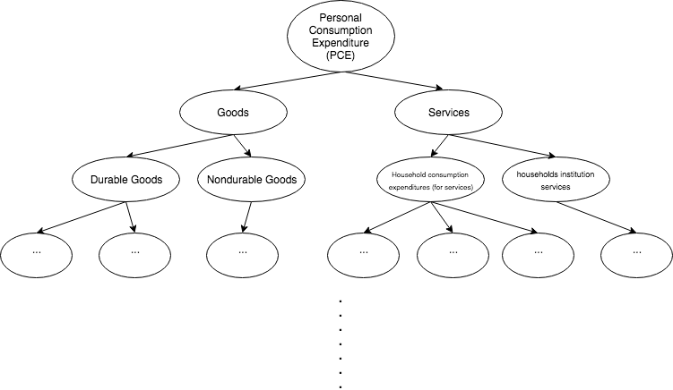
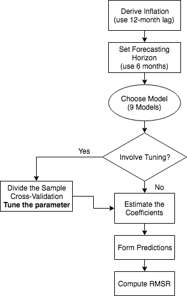
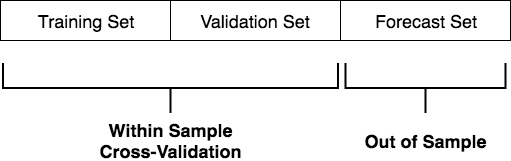

```{r, echo = FALSE, message = F}
library(tidyverse)
library(ggplot2)
library(dplyr)
library(knitr)
library(kableExtra)
```

## Motivation

Inflation is one of the few key economic variables for monetary policymakers. There is a huge literature on forecasting aggregate inflation, given the importance of these forecasts for monetary policy. 

There are a large number of variables that may be helpful for forecasting inflation. Putting all these variables into the model leads to bad out of sample forecasts. 

---

## Motivation (cont.)

There are two problems when we add too many RHS variables into a model:

* overfitting in sample
* low degrees of freedom

Recent studies have shown that dynamic factor models may provide a parsimonious way to include incoming information about a wide variety of economic activity.

* Stock and Watson (1999, 2002)
* Bernanke and Boivin (2003)
* Bernanke, Boivin, and Eliasz (2005)
* Giannone, Reichlin, and Sala (2005)

---

## Contribution

This paper explores the potential use of recently developed techniques in the machine learning literature, and compares the performance of various models (including dynamic factor models.)

This paper contributes to the literature by

* Evaluating various novel forecast modeling strategies from machine learning literature
* Exoloring the possibility of improving performance by adding **interaction** terms
* Introducing the idea of cross-validation into beyesian estimation for forecasting 

---

## Disaggregated Data

There is also some literature that investigates using disaggregated information on inflation to forecast aggregate inflation.

The Personal Consumption Expenditure Price Deflator (PCEPI) is aggregated from price indexes of a large number of underlying goods and service categories.

PCEPI is a United States-wide indicator of the average increase in prices for all domestic personal consumption. It is benchmarked to a base of 2009 = 100.


---

## Disaggregated Data (cont.)


---

## Disaggregate Data (cont.)

```{r, echo = FALSE}
dt <- read.table("../data/levelcounts.csv",sep = ",",header = FALSE)
colnames(dt) <- c("level", "counts")
kable(dt) %>% 
    kable_styling(bootstrap_options = "striped", full_width = F, position = "float_left")
```

.pull-right[
So far we have explored the aggregation level 4 which contains 55 vectors of variables. We will explore the performance of each model at each level of aggregation.
]

---

## Models

So far we have explored and compared the following forecasting techniques. Performance is measured by root mean square error (RMSE):

* ARM:  Auto-regressive model
* OLS:  OLS model
* MAG:  Model averaging with equal weights
* DFM:  Dynamic factor model
* RDG:  Ridge model
* LAS:  LASSO model
* RFM:  Random forrest model
* BMA:  Bayesian model averagin model

For the future research we will also add 

* ENM:  Elastic net model
* DLM:  Deep learning model
* ......

---

## Prediction Formation

<center>

<center>

--- 
---

## Auto-regressive Model

1. Estimated the following model using $Y_{1:T_0}$
.large[
$$Y^A_{t+h} = \beta_0 + \beta ' \cdot Y^A_{t} + \varepsilon_t$$]
2. "Forecast" within-sample predictions for $Y_{T_0+h:T}$

3. Compute the RMSE given the sample

---

## OLS Model

Let $\tilde Y^D_{t}$ be the disaggregaed data dropping the last column 
.large[
$$Y^A_{t+h} = \beta_0 + \beta_1Y^A_{t} + \beta_2 \cdot \tilde Y^D_{t}  +\varepsilon_t$$]

Drop the last column to avoid perfect multicolinarity

---

## Model Averaging

To implement the model averaging technique, we estimate
$$Y_{t+h} = \beta_0 + \beta_1Y^A_{t} + \beta^i_2 \cdot y^{D,i}_t + \varepsilon_t$$
Define 
$$\beta^i = [\beta_0, \beta_1, \beta^{'i}_2]'$$
$$RHS^i_t = [1, Y^A_t, y_t^{D,i}]$$
Then the equal weight prediction for 
$$\hat Y_{t+h} = \frac{1}{K}\sum_{i}^{K} \beta^i \cdot RHS^i_t$$
---

## Dynamic Factor Model

Apply dimensionreduction techniques - principal component analysis (PCA) to produce the weighting vector. Let $f_t$ be the matrix computed from PCA. 
.large[
$$Y_{t+h} = \beta_0 + \beta_1Y^A_{t} + \beta_2 \cdot f_t + \varepsilon_t$$]

---

## Ridge, Lasso and Random Forrest

To implement the machine learning techniques for evaluating out-of-sample forecasting performance, we need to divide our data into three pieces:
<center>

<center>


